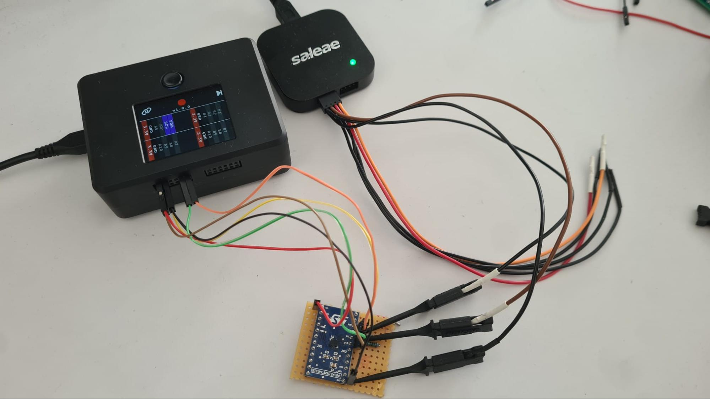
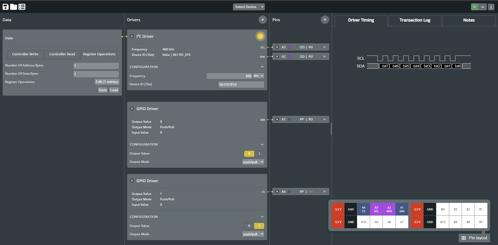
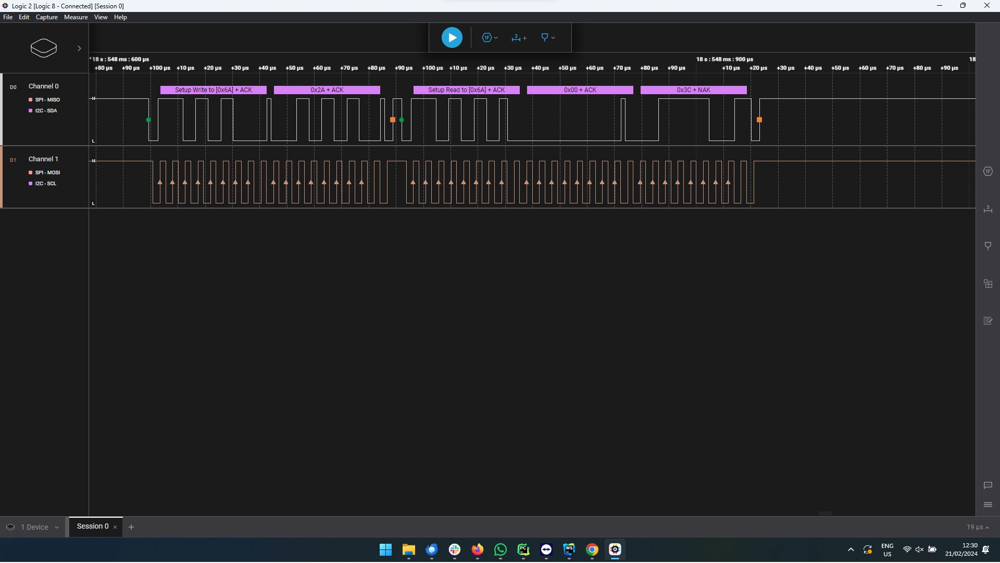
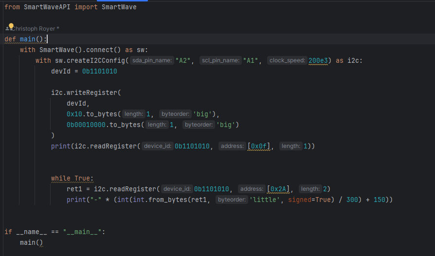
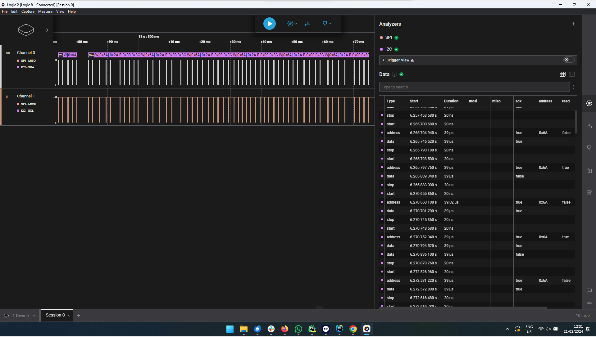
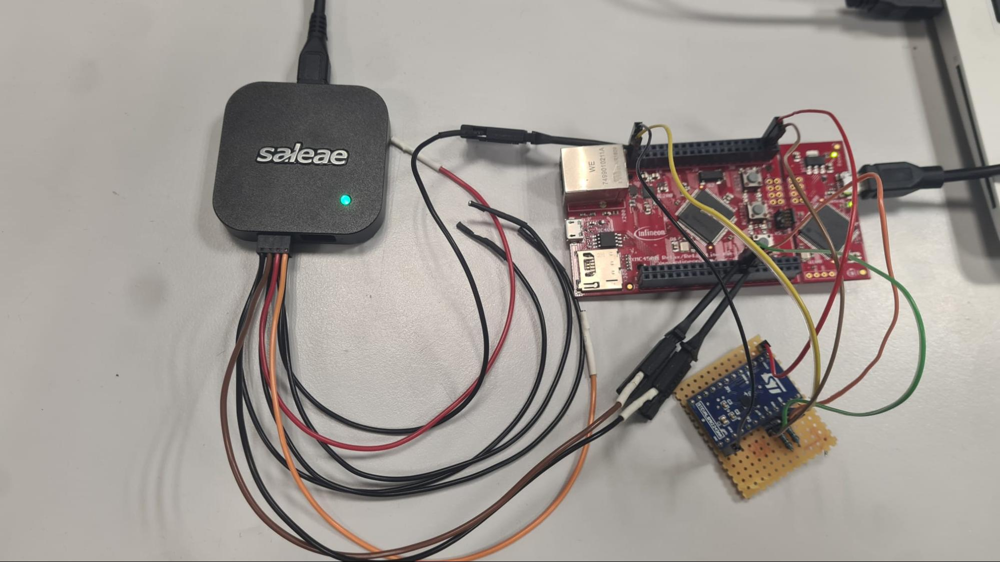
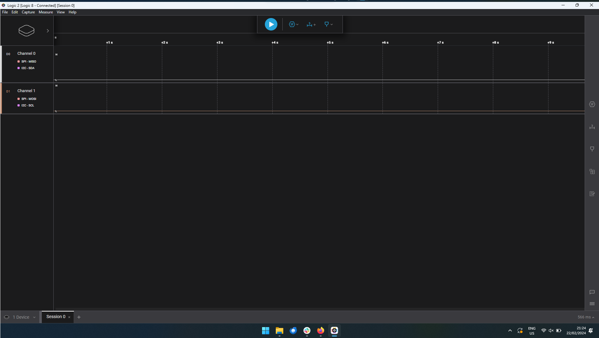
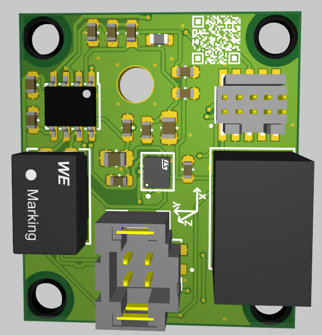
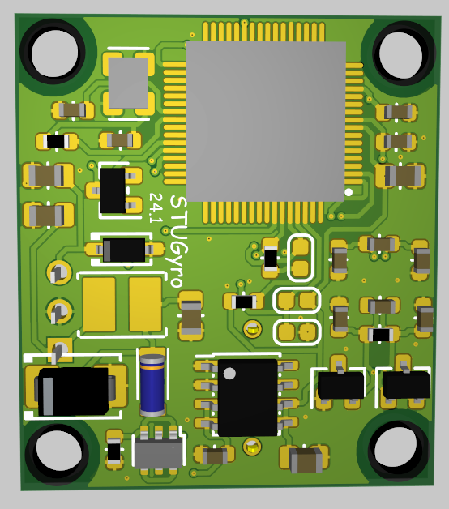

# Sensor evaluation: from an idea to a PCB in a day

#### The task

After meeting a representative of [ST Microelectronics](https://www.st.com/content/st_com/en.html) at a trade fair, 
they generously agreed to support us with their components.
After looking through their wide portfolio of sensors,
my attention fell on their [ASM330LHHXG1](https://www.st.com/en/mems-and-sensors/asm330lhhxg1.html) automotive inertial measurement unit (IMU).
Since we already require several gyroscopes in our Tankia for controlling,
this would be a good opportunity to try to develop our own custom version with a focus on simplicity and weight. 
To help with the development process, we were also provided with ST’s [STEVAL-MKI243A](https://www.st.com/en/evaluation-tools/steval-mki243a.html) 
adapter board to easily test and evaluate the sensor.

The goal was to create a CAN-enabled IMU with custom filtering capabilities. 
Being able to program the gyroscope ourselves would bring the advantage of easily altering its behavior
to perfectly suit our needs. 
So I chose to develop a custom PCB containing little more than an Infineon microcontroller,
a CAN transceiver and the IMU.
The board would be powered by a 24V supply, so a buck converter to 3.3V would also be necessary.

#### Establishing first communication: 30min
After the evaluation board from ST Microelectronics arrived,
the first task was to set up a test bench and evaluate the communication protocol. 
As is the case with many sensor ICs, the communication with the IMU is I2C-based, 
with the microcontroller setting and reading different registers for altering settings and reading out acceleration and rotation. 
I used semify’s [SmartWave Control](https://www.semify-eda.com/smartwave) to provide the I2C commands 
and [Saleae’s Logic 8](https://www.saleae.com/)  to monitor the data and clock lines.

I used SmartWave’s [browser-based GUI](https://gui.smart-wave-control.com/) to send a few commands to the IMU. 
It’s designed to be easy to use, so I got the communication up and running in just a few clicks. 
I added an I2C driver for the communication, and one GPIO pin each for the “CS” pin and the “address bit 0” pin.
After starting the transaction, I could see the results in the built-in transaction log.

I then set up the Saleae Logic analyzer to check the communication.
I opened [Logic 2](https://www.saleae.com/) and added an I2C analyzer so I wouldn’t have to manually decode all of the signals. 
At first, no ACK bit was received at the end of a message because I had made a typo in the address of the IMU. 
After that was fixed, I got my first successful communication: the sensor sent back the expected value after reading out the “WHOAMI” register.

 

#### Creating a stream of data: 15 min
The next step was to figure out a reasonable cycle time for the sensor. 
To get a stream of data from the SmartWave, I used the provided [Python API](https://pypi.org/project/SmartWaveAPI/) 
to create a small script that repeatedly reads out the sensor data and plots them in the console. 
This API is comparatively more effort to use than the GUI, 
but it lets me have more control over the interaction between the SmartWave and the device.

I took a look at the trace in Logic 2 and measured the average time between transactions. 
I figured a cycle time of 1ms would be easily manageable for the sensor.
That would be more than enough for the controlling needs of the Tankia.

#### Implementation details: 2h
With this information, I was ready to start coding with the actual microcontroller we would use in our car: an [XMC4400-F64](https://www.infineon.com/cms/en/product/microcontroller/32-bit-industrial-microcontroller-based-on-arm-cortex-m/32-bit-xmc4000-industrial-microcontroller-arm-cortex-m4/xmc4400-f64k256-ba/). 
It’s a mid-featured model of Infineon’s line of industrial microcontrollers, and I chose it because of its price and relatively small footprint.
I created a testbench with an XMC4400-F64 development board,
the [STEVAL-MKI243A](https://www.st.com/en/evaluation-tools/steval-mki243a.html) IMU evaluation board, 
and the [Saleae Logic 8](https://www.saleae.com/).

I started coding in Infineon’s [Dave IDE](https://softwaretools.infineon.com/tools/com.ifx.tb.tool.daveide). 
It is a great tool for embedded software development, because the provided Apps take care of all register operations and hardware resource allocations.
This way, the programmer doesn’t need to worry about the hardware - making development accessible even to beginners. 
I added the App for an I2C interface and created a sample code snippet to read the required registers from the sensor. 
After building and running the code on the microcontroller at first nothing happened. 
Logic 2 showed that both the SDA and the SCL line stayed low during the whole communication attempt of the microcontroller.

As it turns out, the XMC microcontrollers do not provide an on-chip pullup for I2C communication.
This is however required as the open-drain configuration of the pins only allow for pulling down the signal,
relying on a pullup resistor to get the line back to a high state whenever no device is sending a “0”.
After adding external pullups, communication worked as expected. 
With the learnings from the previous steps, implementing the communication protocol was a breeze
and I had the whole codebase finished in as little as 2 hours.

#### Creating a PCB: 5h
Now the only step left was to create a PCB to package all this functionality in a small form factor.
While I was able to reuse a lot of parts from other designs, and it is a relatively simple PCB,
this was still the most time-consuming step. 
Placing all the components in a way to minimize PCB space took its time.
Here you can see the final result; 
A tiny little PCB capable of evaluating an automotive inertial measurement unit and sending the results over CAN.
The buck converter and the common-mode choke for the CAN lines take up by far the most space, 
but still the whole PCB only has dimensions of 31x27mm.

#### Saleae Logic and SmartWave Control: best friends in embedded systems development
This rapid development cycle was possible because of two devices: 
[Saleae’s Logic 8](https://www.saleae.com/)
and [semify’s SmartWave Control](https://www.semify-eda.com/smartwave). 
They work together to make both parts of IC communication easy: 
generating known good signals with SmartWave, 
and observing the actual behavior with the Logic 8.

All in all, it took me less than 8 hours to get from first unpacking the sensor to a finished ready-for-production PCB. 
This rapid development cycle is indicative of the spirit of formula student:
development and innovation without too many restrictions, while still keeping a clear goal in mind.

